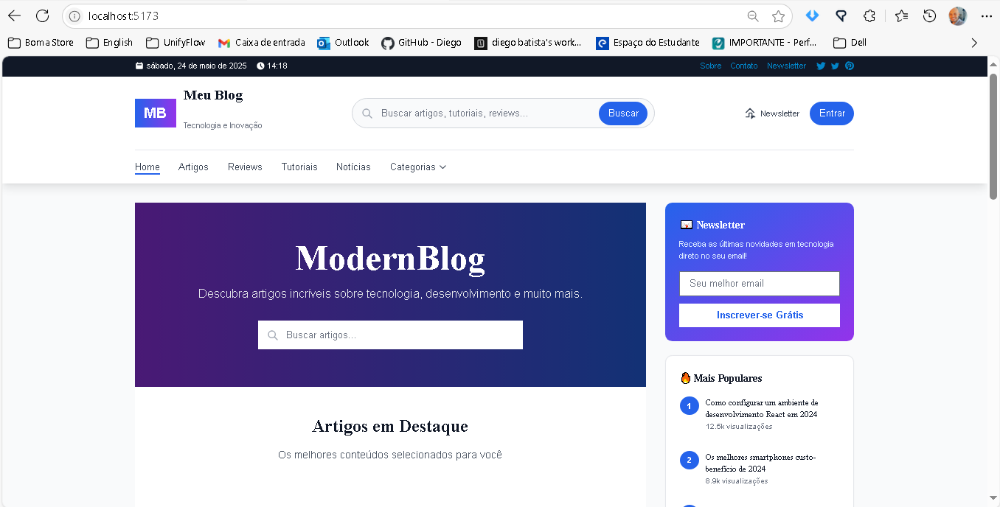

# Modern Blog - Laravel 12 + Vue 3

Um blog moderno construído com Laravel 12 e Vue 3, com painel administrativo completo e site público para leitura de artigos.

## Características

- Backend: Laravel 12 com Sanctum para autenticação API
- Frontend: Vue 3 com Vite + TailwindCSS
- Banco de Dados: MySQL
- Painel admin com autenticação e permissões (admin, autor)
- Site público separado para leitura de artigos
- Editor rich text (TipTap)
- Upload e gerenciamento de imagens
- SEO otimizado
- Sistema de anúncios integrado
- Agendamento de publicações

## Requisitos

- PHP 8.2+
- Composer
- Node.js 18+
- MySQL 8.0+
- Docker (opcional, para usar com Laravel Sail)

## Instalação

### Usando Docker com Laravel Sail

1. Clone o repositório:
\`\`\`bash
git clone https://github.com/seu-usuario/modern-blog.git
cd modern-blog
\`\`\`

2. Instale as dependências do PHP:
\`\`\`bash
docker run --rm \
    -u "$(id -u):$(id -g)" \
    -v "$(pwd):/var/www/html" \
    -w /var/www/html \
    laravelsail/php82-composer:latest \
    composer install --ignore-platform-reqs
\`\`\`

3. Configure o arquivo .env:
\`\`\`bash
cp .env.example .env
\`\`\`

4. Inicie os contêineres Docker:
\`\`\`bash
./vendor/bin/sail up -d
\`\`\`

5. Gere a chave da aplicação:
\`\`\`bash
./vendor/bin/sail artisan key:generate
\`\`\`

6. Execute as migrações e seeders:
\`\`\`bash
./vendor/bin/sail artisan migrate --seed
\`\`\`

7. Instale as dependências do Node.js e compile os assets:
\`\`\`bash
./vendor/bin/sail npm install
./vendor/bin/sail npm run dev
\`\`\`

### Instalação Local (sem Docker)

1. Clone o repositório:
\`\`\`bash
git clone https://github.com/seu-usuario/modern-blog.git
cd modern-blog
\`\`\`

2. Instale as dependências do PHP:
\`\`\`bash
composer install
\`\`\`

3. Configure o arquivo .env:
\`\`\`bash
cp .env.example .env
\`\`\`

4. Gere a chave da aplicação:
\`\`\`bash
php artisan key:generate
\`\`\`

5. Configure seu banco de dados no arquivo .env e execute as migrações e seeders:
\`\`\`bash
php artisan migrate --seed
\`\`\`

6. Instale as dependências do Node.js e compile os assets:
\`\`\`bash
npm install
npm run dev
\`\`\`

7. Inicie o servidor:
\`\`\`bash
php artisan serve
\`\`\`

## Acessando o Sistema

Após a instalação, você pode acessar:

- Site público: http://localhost
- Painel administrativo: http://localhost/admin

## View

